<p align="center">
  
</p>

<p align="center">
  <a href="https://github.com/ishandutta2007/Awesome-Awesome-Awesome"></a><a href="https://discord.gg/jc4xtF58Ve"></a>
  <a href="https://github.com/ishandutta2007/Awesome-Vacation-Rental-Management/stargazers"></a>
  <a href="https://github.com/ishandutta2007/Awesome-Vacation-Rental-Management/network/members"></a>
  <a href="https://github.com/ishandutta2007/Awesome-Vacation-Rental-Management/blob/main/LICENSE"></a>
  <a href="https://github.com/ishandutta2007/Awesome-Vacation-Rental-Management/pulls"></a>
</p>

---

# 🏖️ Awesome Vacation Rental Management (VRM & PMS) 🏡

> **A comprehensive, SEO-optimized, and curated directory of commercial SaaS platforms, Property Management Systems (PMS), Channel Managers, and Open-Source building blocks for Short-Term Rental (STR), Airbnb, Vrbo, Booking.com, and direct-booking hospitality operations.**

📅 **Last Updated:** August 2026

---

## 📑 Table of Contents

- [🌟 Overview](#-overview)
- [🏢 SaaS & Hosted Commercial Platforms](#-saas--hosted-commercial-platforms)
- [💻 Open-Source Repositories (Ranked by Stars)](#-open-source-repositories-ranked-by-stars)
- [🗂️ Open-Source Categorized Ecosystem](#️-open-source-categorized-ecosystem)
  - [🏠 Vacation Rental & Hospitality PMS](#-vacation-rental--hospitality-pms)
  - [📅 Booking Engines, Scheduling & Calendar Infrastructure](#-booking-engines-scheduling--calendar-infrastructure)
  - [⚡ Workflow Automation & Event Streaming](#-workflow-automation--event-streaming)
  - [💬 Omnichannel Guest Messaging & Support](#-omnichannel-guest-messaging--support)
  - [🔐 Identity, Access & Smart Lock / IoT Automation](#-identity-access--smart-lock--iot-automation)
  - [🗄️ Databases, Search & Backend Infrastructure](#️-databases-search--backend-infrastructure)
  - [💳 Hospitality Billing, Payments & Headless Commerce](#-hospitality-billing-payments--headless-commerce)
- [🏗️ Open-Source Vacation Rental Architecture Stack](#️-open-source-vacation-rental-architecture-stack)
- [🧠 Essential Vacation Rental Management Concepts](#-essential-vacation-rental-management-concepts)
- [🤝 How to Contribute](#-how-to-contribute)
- [📜 License](#-license)

---

## 🌟 Overview

The modern **Vacation Rental Management (VRM)** ecosystem empowers hosts, co-hosts, boutique property managers, and hospitality enterprises to automate end-to-end guest lifecycles and property operations:
- 🔄 **Channel Management (OTA Sync):** Real-time synchronization of rates, calendars, availability, and restrictions across Airbnb, Vrbo, Booking.com, Expedia, and Google Vacation Rentals.
- 💬 **Guest Communication:** AI-assisted messaging, automated check-in instructions, digital guidebooks, and SMS/WhatsApp notifications.
- 🧹 **Turnover & Housekeeping Operations:** Automated cleaning task assignments, turnover checklists, damage photo inspection uploads, and cleaner scheduling.
- 🔑 **Smart Home Automation:** Keyless smart lock PIN generation linked to check-in/check-out dates, automated thermostats, and noise/occupancy monitoring.
- 💳 **Direct Bookings & Finance:** Zero-commission direct-booking websites, payment gateways, trust accounting, owner statements, and local occupancy tax calculations.

---

## 🏢 SaaS & Hosted Commercial Platforms

Below is the verified breakdown of leading commercial SaaS vacation rental platforms, **sorted in descending order by company size (Valuation / Annual Revenue / Enterprise Scale)**.

| 🏷️ SaaS Platform | 📊 Company Scale / Valuation / Revenue | 💵 Starting Tier Price | 🎁 Free Tier & Trial Limits | 🚀 Key Capabilities & Target Audience |
| :--- | :--- | :--- | :--- | :--- |
| **[Escapia](https://www.escapia.com/)** | **~$22B Market Cap** *(Expedia Group parent / $14.7B revenue; 300k+ units)* | **$100 – $250 / month base** *(~$9–$10/unit/mo at scale)* | **0-day free trial** *(No free plan; custom 1-on-1 enterprise demo only)* | Enterprise PMS by Expedia Group with native Vrbo distribution, multi-unit trust accounting, and owner portals. |
| **[Hostaway](https://www.hostaway.com/)** | **~$1.0B Valuation** *(Unicorn / $100M+ ARR; $365M+ funding)* | **$100 / month base** *(~$20–$50/unit/mo; $300+ setup fee)* | **0-day free trial** *(No free plan; personalized live guided demo only)* | Leading all-in-one PMS & channel manager with AI messaging, dynamic pricing integrations, and open API. |
| **[Guesty](https://www.guesty.com/)** | **~$900M Valuation** *(~$165M ARR; $410M+ funding)* | **$9 – $29 / listing / month** *(*Guesty Lite* for 1–3 listings)* | **14-day free trial** *(Full access to Guesty Lite for 1–3 listings, no credit card required)* | Comprehensive end-to-end property management suite for growing operators and enterprise managers. |
| **[Guesty For Hosts](https://www.guesty.com/)** | **Part of Guesty** *($900M Valuation / $165M ARR)* | **$29 / month** *(1 listing; formerly YourPorter)* | **14-day free trial** *(Full features for up to 3 listings, no credit card required)* | Mobile-first PMS built for solo hosts and small portfolios with automated guest messaging and calendar sync. |
| **[Streamline](https://www.streamlinevrs.com/)** | **~$50M+ ARR** *(Part of Inhabit IQ; $1B+ enterprise backing)* | **$250 – $400 / month base** *(~$15–$25/unit/mo)* | **0-day free trial** *(No free plan; customized enterprise demo only)* | Advanced enterprise PMS suite featuring native trust accounting, CRM, housekeeping routing, and revenue management. |
| **[RMS Cloud](https://www.rmscloud.com/)** | **~$40M+ ARR** *(6,000+ properties across 70+ countries)* | **$55 / month base** *(Scales by unit volume)* | **0-day free trial** *(No free plan; free customized consultation demo only)* | Cloud hospitality platform supporting serviced apartments, multi-unit vacation rentals, resorts, and hotels. |
| **[Track PMS](https://trackhs.com/)** | **~$30M+ ARR** *($1B+ managed GMV; TravelNet Solutions)* | **$300 – $500 / month base** *(~$12–$20/unit/mo)* | **0-day free trial** *(No free plan; customized enterprise demo only)* | Enterprise-grade hospitality PMS, CRM, omnichannel contact center, and distribution engine for luxury portfolios. |
| **[eviivo](https://eviivo.com/)** | **~$30M+ ARR** *($1B+ GMV; 20,000+ properties globally)* | **$40 – $50 / month** *(1 property; $125/mo for multi-property)* | **30-day organized trial** *(Organized via consultation/demo; no self-serve free plan)* | All-in-one booking platform & channel manager (eviivo Suite) for boutique rentals, B&Bs, and urban properties. |
| **[Avantio](https://www.avantio.com/)** | **~$25M+ ARR** *(Acquired by Planet; 40,000+ properties)* | **$200 – $250 / month base** *(Minimum 10–20 units; 0% commission)* | **0-day free trial** *(No free plan; personalized agency demo only)* | Agency-focused PMS, global channel manager, and custom direct-booking engine for mid-to-large rental agencies. |
| **[Lodgify](https://www.lodgify.com/)** | **~$15M – $20M ARR** *($35M+ funding; 50,000+ properties)* | **$16 – $18 / month** *(Starter annual) or $23–$26/mo (monthly)* | **7-day free trial** *(Full access to website builder and channel manager, no credit card required)* | Direct-booking website builder, reservation engine, and multi-channel sync for individual hosts and small operators. |
| **[Hospitable](https://hospitable.com/)** | **~$10M – $15M ARR** *($500M+ GMV; 400,000+ listings)* | **$25 / month** *(Annual) or $29/mo (monthly for 1st unit, +$9/add'l unit)* | **Free Essentials Plan** *(Free forever for basic direct bookings; 14-day full trial on paid tiers)* | Automation-first PMS with AI guest communications, auto-responses, turnover management, and unified inboxes. |
| **[Smoobu](https://www.smoobu.com/)** | **~$10M – $15M ARR** *(Acquired by GuestReady; 50,000+ properties)* | **€26.10 / month** *(Flex annual) or €29/mo (monthly, +0.9% fee) / €31.50/mo (Prepaid)* | **14-day free trial** *(Unrestricted access to all core PMS and channel sync features, no credit card required)* | Centralized calendar synchronization, digital guest guidebooks, booking engine, and multi-channel synchronization. |
| **[Uplisting](https://www.uplisting.io/)** | **~$10M – $15M Valuation** *(Acquired by Guesty; $5M+ ARR)* | **$100 / month** *(Flat base for up to 5 properties; +$20/mo per extra unit)* | **14-day free trial** *(Full feature access with 0% booking fees, no credit card required)* | Multi-channel PMS and channel manager featuring automated messaging, cleaning scheduler, and unified inbox. |
| **[OwnerRez](https://www.ownerrez.com/)** | **~$8M – $10M ARR** *(Bootstrapped & profitable; 50,000+ listings)* | **$40 / month** *(1 property; sliding scale decreases per extra unit)* | **14-day free trial** *(Full access to all PMS features and premium add-ons, no credit card required)* | Elite PMS for technical hosts with advanced direct-booking engines, guest verification, trust accounting, and open APIs. |
| **[Hostfully](https://www.hostfully.com/)** | **~$8M – $10M ARR** *($7M+ funding; 30,000+ properties)* | **$109 – $129 / month base** *(Up to 4 listings; or $15/unit/mo Growth tier)* | **Free Plan for 1 Digital Guidebook** *(Free forever for 1 guidebook; guided demo for PMS platform)* | Award-winning vacation rental PMS and channel manager tightly integrated with digital guest guidebooks. |
| **[iGMS](https://www.igms.com/)** | **~$8M – $12M ARR** *(200,000+ listings connected)* | **$16 – $20 / property / month** *(Pro) or $1/booked night (Flex, min. $20/mo)* | **14-day free trial** *(Full access to multi-calendar, automations, and AI inbox, no credit card required)* | Short-term rental automation platform with native multi-channel sync, auto-messaging, team task, and cleaning tools. |
| **[BookingSync (Smily)](https://www.bookingsync.com/)** | **~$5M – $8M ARR** *($5M+ funding)* | **€347 / month base** *(Or ~€29/listing with €150/mo minimum)* | **0-day free trial** *(No free plan; customized demo only)* | European vacation rental management ecosystem supporting multi-channel distribution, apps, and direct bookings. |
| **[LiveRez](https://www.liverez.com/)** | **~$5M – $8M ARR** *(Part of Inhabit IQ)* | **$250 / month base** *(Pay-for-performance partnership model)* | **0-day free trial** *(No free plan; personalized sales demo only)* | Vacation rental management software providing website booking engines, channel distribution, and accounting. |
| **[Ciirus](https://www.ciirus.com/)** | **~$5M ARR** *(30,000+ vacation homes)* | **$99 / month base** *(~$10–$25/property/mo)* | **0-day free trial** *(No free plan; personalized guided demo and setup consultation only)* | Vacation rental PMS and channel distribution engine designed for Florida and international property managers. |
| **[Barefoot](https://www.barefoot.com/)** | **~$5M ARR** *(Niche enterprise player)* | **$800 / month base** *(Tier covers 1–50 units; +$300/mo per extra 50 units)* | **0-day free trial** *(No free plan; "No Cost Exploration" consultation demo only)* | Fully customizable enterprise PMS tailored for professional vacation rental managers requiring bespoke operational workflows. |
| **[Beds24](https://www.beds24.com/)** | **~$3M – $5M ARR** *(Bootstrapped; 100,000+ rooms/units)* | **€15.90 / month** *(1 property/unit; +€3/mo per extra unit; 0% commission)* | **14-day free trial** *(Fully functional channel manager & PMS account, no credit card required)* | Highly customizable, developer-friendly PMS and channel manager with 0% booking commission and extensive API capabilities. |
| **[Hosthub](https://www.hosthub.com/)** | **~$2M – $4M ARR** *($2M funding)* | **$29 / month** *(Annual) or $39/mo (monthly per rental)* | **14-day free trial** *(Full access to 0-double-booking channel manager, no credit card required)* | Specialized channel manager guaranteeing zero double-bookings across 200+ OTAs, with direct booking engines. |
| **[Lodgix](https://lodgix.com/)** | **~$2M – $3M ARR** *(Bootstrapped; thousands of properties)* | **$69.99 / month base** *(Covers 1–7 properties)* | **30-day free trial** *(Full features and integrations, no credit card required)* | Cloud vacation rental PMS and online booking software featuring QuickBooks syncing, WordPress plugins, and channel sync. |

---

## 💻 Open-Source Repositories (Ranked by Stars)

All open-source projects relevant to building and self-hosting a vacation rental management platform, **sorted in descending order by GitHub Stars ⭐**.

| 📦 Repository | ⭐ GitHub Star Badge | 📝 Core Domain / Description |
| :--- | :--- | :--- |
| **[Supabase](https://github.com/supabase/supabase)** | [](https://github.com/supabase/supabase/stargazers) | Open-source Firebase alternative with PostgreSQL, Auth, Realtime calendar triggers, and Edge Functions. |
| **[Home Assistant](https://github.com/home-assistant/core)** | [](https://github.com/home-assistant/core/stargazers) | IoT property automation platform for smart locks, HVAC climate control, energy sensors, and occupancy monitoring. |
| **[Redis](https://github.com/redis/redis)** | [](https://github.com/redis/redis/stargazers) | In-memory data structure store for booking availability caching, session management, and distributed calendar locks. |
| **[Grafana](https://github.com/grafana/grafana)** | [](https://github.com/grafana/grafana/stargazers) | Analytics and interactive visualization web application for tracking occupancy, RevPAR, and sensor health. |
| **[n8n](https://github.com/n8n-io/n8n)** | [](https://github.com/n8n-io/n8n/stargazers) | Fair-code workflow automation tool connecting booking webhooks, SMS/Email guest messaging, and IoT locks. |
| **[Prometheus](https://github.com/prometheus/prometheus)** | [](https://github.com/prometheus/prometheus/stargazers) | Systems monitoring and time-series database for hospitality server uptime and IoT telemetry alerting. |
| **[Meilisearch](https://github.com/meilisearch/meilisearch)** | [](https://github.com/meilisearch/meilisearch/stargazers) | Ultra-fast, typo-tolerant search engine for vacation rental listings, amenities, locations, and direct-booking portals. |
| **[MinIO](https://github.com/minio/minio)** | [](https://github.com/minio/minio/stargazers) | High-performance S3-compatible object storage for property photos, inspection records, and invoice PDFs. |
| **[PocketBase](https://github.com/pocketbase/pocketbase)** | [](https://github.com/pocketbase/pocketbase/stargazers) | Lightweight open-source Go backend with embedded SQLite, auth, and realtime subscriptions for rental apps. |
| **[Appwrite](https://github.com/appwrite/appwrite)** | [](https://github.com/appwrite/appwrite/stargazers) | Secure end-to-end backend server for web, mobile, and flutter guest apps and property management portals. |
| **[Odoo Community](https://github.com/odoo/odoo)** | [](https://github.com/odoo/odoo/stargazers) | Open-source ERP suite with CRM, double-entry accounting, invoicing, point of sale, and website builder. |
| **[Cal.com](https://github.com/calcom/cal.com)** | [](https://github.com/calcom/cal.com/stargazers) | Open-source scheduling infrastructure for guest check-ins, cleaner arrivals, maintenance, and host calls. |
| **[Directus](https://github.com/directus/directus)** | [](https://github.com/directus/directus/stargazers) | Real-time headless CMS & dynamic data platform for managing properties, amenities, pricing, and bookings. |
| **[Apache Kafka](https://github.com/apache/kafka)** | [](https://github.com/apache/kafka/stargazers) | Distributed event streaming platform for processing high-throughput reservation feeds and OTA channel sync. |
| **[Medusa](https://github.com/medusajs/medusa)** | [](https://github.com/medusajs/medusa/stargazers) | Headless commerce engine customizable for direct-booking checkouts, stay add-ons, excursions, and fees. |
| **[Keycloak](https://github.com/keycloak/keycloak)** | [](https://github.com/keycloak/keycloak/stargazers) | Identity and access management solution providing SSO, OAuth 2.0 / OpenID Connect, and RBAC for multi-tenant PMS. |
| **[Celery](https://github.com/celery/celery)** | [](https://github.com/celery/celery/stargazers) | Distributed Python task queue for background calendar polling, email/SMS dispatch, and pricing calculations. |
| **[Chatwoot](https://github.com/chatwoot/chatwoot)** | [](https://github.com/chatwoot/chatwoot/stargazers) | Omnichannel customer support and messaging platform connecting guest WhatsApp, SMS, email, and live chat. |
| **[ERPNext](https://github.com/frappe/erpnext)** | [](https://github.com/frappe/erpnext/stargazers) | Full-featured ERP covering trust accounting, vendor purchasing, housekeeping inventory, and financial reporting. |
| **[Saleor](https://github.com/saleor/saleor)** | [](https://github.com/saleor/saleor/stargazers) | GraphQL-powered headless commerce engine supporting multi-currency booking payments and ancillary services. |
| **[Node-RED](https://github.com/node-red/node-red)** | [](https://github.com/node-red/node-red/stargazers) | Low-code flow-based visual programming for property sensors, automated lock codes, and environmental controls. |
| **[FullCalendar](https://github.com/fullcalendar/fullcalendar)** | [](https://github.com/fullcalendar/fullcalendar/stargazers) | Industry-standard JavaScript calendar component for building multi-property reservation matrices and timeline views. |
| **[Authentik](https://github.com/goauthentik/authentik)** | [](https://github.com/goauthentik/authentik/stargazers) | Open-source unified Identity Provider for securing internal PMS portals, cleaner apps, and owner dashboards. |
| **[BookStack](https://github.com/BookStackApp/BookStack)** | [](https://github.com/BookStackApp/BookStack/stargazers) | Self-hosted documentation wiki engine ideal for creating interactive, searchable digital house manuals and guest guides. |
| **[PostgreSQL](https://github.com/postgres/postgres)** | [](https://github.com/postgres/postgres/stargazers) | Powerful relational database for ACID-compliant reservation tables, property listings, rates, and booking ledgers. |
| **[Matrix Synapse](https://github.com/element-hq/synapse)** | [](https://github.com/element-hq/synapse/stargazers) | Decentralized Matrix homeserver for secure, encrypted internal staff communications and automated guest notifications. |
| **[Temporal](https://github.com/temporalio/temporal)** | [](https://github.com/temporalio/temporal/stargazers) | Durable execution platform for reliable multi-step booking lifecycles, payment capture, and lock code provisioning. |
| **[RabbitMQ](https://github.com/rabbitmq/rabbitmq-server)** | [](https://github.com/rabbitmq/rabbitmq-server/stargazers) | High-performance message broker for asynchronous booking notifications, calendar events, and worker distribution. |
| **[OpenSearch](https://github.com/opensearch-project/OpenSearch)** | [?style=social&color=white)](https://github.com/opensearch-project/OpenSearch/stargazers) | Scalable search and analytics suite for property search, guest inquiry indexing, and server log analysis. |
| **[Frappe Framework](https://github.com/frappe/frappe)** | [](https://github.com/frappe/frappe/stargazers) | Python & JavaScript full-stack web framework built for rapid creation of custom property management applications. |
| **[Eclipse Mosquitto](https://github.com/eclipse-mosquitto/mosquitto)** | [](https://github.com/eclipse-mosquitto/mosquitto/stargazers) | Lightweight MQTT message broker connecting smart locks, temperature sensors, noise detectors, and power meters. |
| **[Zammad](https://github.com/zammad/zammad)** | [](https://github.com/zammad/zammad/stargazers) | Web-based open-source ticketing and customer support system for guest issue escalation and maintenance requests. |
| **[OpenStreetMap](https://github.com/openstreetmap/openstreetmap-website)** | [](https://github.com/openstreetmap/openstreetmap-website/stargazers) | Collaborative mapping platform for rendering interactive property location maps and local attraction guides. |
| **[Shlink](https://github.com/shlinkio/shlink)** | [](https://github.com/shlinkio/shlink/stargazers) | Self-hosted URL shortener for generating branded, tracking-enabled guest links for SMS check-in portals and WiFi codes. |
| **[rrule](https://github.com/jakubroztocil/rrule)** | [](https://github.com/jakubroztocil/rrule/stargazers) | JavaScript library for parsing and generating RFC 5545 recurrence rules for periodic cleaning and property inspections. |
| **[Nominatim](https://github.com/osm-search/Nominatim)** | [](https://github.com/osm-search/Nominatim/stargazers) | Open-source geocoding and reverse geocoding engine for address autocomplete and property coordinate lookup. |
| **[Easy!Appointments](https://github.com/alextselegidis/easyappointments)** | [](https://github.com/alextselegidis/easyappointments/stargazers) | Highly customizable booking scheduler for on-site services, property viewings, luggage drops, and cleaning visits. |
| **[Kill Bill](https://github.com/killbill/killbill)** | [](https://github.com/killbill/killbill/stargazers) | Enterprise-grade billing and payments engine for subscription management, split payouts, and automated invoices. |
| **[PostGIS](https://github.com/postgis/postgis)** | [](https://github.com/postgis/postgis/stargazers) | Spatial database extender for PostgreSQL powering radius-based property searches and territory management. |
| **[OpenHAB](https://github.com/openhab/openhab-core)** | [](https://github.com/openhab/openhab-core/stargazers) | Java-based vendor-neutral home automation core for integrating diverse smart property locks, HVAC, and sensors. |
| **[iCal.js](https://github.com/kewisch/ical.js)** | [](https://github.com/kewisch/ical.js/stargazers) | Comprehensive JavaScript parser and generator for iCalendar (RFC 5545) synchronization with Airbnb/Vrbo/OTAs. |
| **[node-ical](https://github.com/jens-maus/node-ical)** | [](https://github.com/jens-maus/node-ical/stargazers) | Fast Node.js iCal parser designed to download, parse, and synchronize remote OTA calendar feeds. |
| **[LibreBooking](https://github.com/librebooking/librebooking)** | [](https://github.com/librebooking/librebooking/stargazers) | Open-source web-based reservation system for managing room, property, equipment, and amenity bookings. |
| **[QloApps](https://github.com/Qloapps/QloApps)** | [](https://github.com/Qloapps/QloApps/stargazers) | Free, open-source hotel management software & direct-booking engine built on PrestaShop for rental accommodation. |
| **[icalendar](https://github.com/collective/icalendar)** | [](https://github.com/collective/icalendar/stargazers) | Robust Python package for parsing, creating, and manipulating RFC 5545 iCalendar feeds for channel sync. |
| **[AbanteCart](https://github.com/abantecart/abantecart)** | [](https://github.com/abantecart/abantecart/stargazers) | PHP-based e-commerce platform that can be extended with booking and accommodation reservation modules. |
| **[Movin' In](https://github.com/aelassas/movinin)** | [](https://github.com/aelassas/movinin/stargazers) | Modern open-source rental property management platform with web and mobile applications, bookings, and Stripe/PayPal. |
| **[Online Rental Property Manager](https://github.com/bigprof-software/online-rental-property-manager)** | [](https://github.com/bigprof-software/online-rental-property-manager/stargazers) | Web-based open-source PHP application for managing properties, units, tenants, leases, and rent payments. |
| **[HotelDruid](https://github.com/etopian/HotelDruid)** | [](https://github.com/etopian/HotelDruid/stargazers) | Open-source Property Management Software for hotels, bed & breakfasts, and vacation homes with multi-language support. |
| **[Open Property](https://github.com/clawnify/open-property)** | [](https://github.com/clawnify/open-property/stargazers) | Self-hosted property management software for managing rental units, leases, rent collection, and maintenance requests. |
| **[LibreProperty](https://github.com/LibreProperty/LibreProperty)** | [](https://github.com/LibreProperty/LibreProperty/stargazers) | Open-source vacation rental PMS focused on Airbnb/Vrbo/Booking.com sync, dynamic pricing, and smart lock integration. |
| **[Pesan PMS](https://github.com/pesanio/pesan-pms)** | [](https://github.com/pesanio/pesan-pms/stargazers) | Open-source PMS application for homestays, villas, guesthouses, and boutique hotels. |
| **[Roost](https://github.com/captainarcher/roost)** | [](https://github.com/captainarcher/roost/stargazers) | Self-hosted vacation rental operations platform built with FastAPI, PostgreSQL, React, and local AI via Ollama *(Archive)*. |
| **[Solidres](https://github.com/solidres/solidres)** | [](https://github.com/solidres/solidres/stargazers) | Open-source accommodation booking and reservation extension for Joomla and WordPress websites. |
| **[OpenSTR](https://github.com/lkilpatrick/OpenSTR)** | [](https://github.com/lkilpatrick/OpenSTR/stargazers) | Self-hosted STR cleaning and turnover operations tool with iCal calendar imports, cleaner scheduling, and checklist photos. |

---

## 🗂️ Open-Source Categorized Ecosystem

### 🏠 Vacation Rental & Hospitality PMS
Dedicated property management systems, cleaning automation, and rental operations engines:
- **[LibreProperty](https://github.com/LibreProperty/LibreProperty)** — Next-generation vacation rental PMS with multi-OTA channel integration, dynamic pricing, and smart lock automation.
- **[OpenSTR](https://github.com/lkilpatrick/OpenSTR)** — Dedicated short-term rental turnover and housekeeping management with iCal synchronization and inspection photo workflows.
- **[Movin' In](https://github.com/aelassas/movinin)** — Modern full-stack rental management system with customer, booking, and administrative apps.
- **[QloApps](https://github.com/Qloapps/QloApps)** — Complete open-source hotel and accommodation booking engine and property management platform.
- **[HotelDruid](https://github.com/etopian/HotelDruid)** — Lightweight web PMS for small vacation homes, bed & breakfasts, and apartments.
- **[Online Rental Property Manager](https://github.com/bigprof-software/online-rental-property-manager)** — Open-source PHP application for managing properties, units, tenants, and leases.
- **[Open Property](https://github.com/clawnify/open-property)** — Self-hosted property management app covering rent collection, tenant tracking, and work orders.
- **[Pesan PMS](https://github.com/pesanio/pesan-pms)** — Lightweight hospitality PMS for homestays, villas, and boutique accommodations.
- **[Solidres](https://github.com/solidres/solidres)** — WordPress/Joomla reservation and room booking extension.
- **[Roost](https://github.com/captainarcher/roost)** — Self-hosted vacation rental automation platform *(Unmaintained)*.

### 📅 Booking Engines, Scheduling & Calendar Infrastructure
Calendar synchronization (iCal/RFC 5545), booking matrices, and appointment tools:
- **[FullCalendar](https://github.com/fullcalendar/fullcalendar)** — Premier JavaScript calendar component for building multi-property reservation timelines and matrices.
- **[Cal.com](https://github.com/calcom/cal.com)** — Open-source scheduling platform for booking guest check-ins, cleaner visits, and owner calls.
- **[Easy!Appointments](https://github.com/alextselegidis/easyappointments)** — Customizable reservation scheduler for on-site services, luggage drops, and cleaning windows.
- **[LibreBooking](https://github.com/librebooking/librebooking)** — Multi-resource and room reservation booking system.
- **[iCal.js](https://github.com/kewisch/ical.js)** — JavaScript parser and generator for iCalendar (RFC 5545) availability synchronization.
- **[node-ical](https://github.com/jens-maus/node-ical)** — Node.js iCal parser for reading, processing, and merging remote Airbnb/Vrbo/OTA calendar feeds.
- **[rrule](https://github.com/jakubroztocil/rrule)** — JavaScript library for recurrence rules (RRULE) for periodic housekeeping and inspections.
- **[icalendar](https://github.com/collective/icalendar)** — Python RFC 5545 iCalendar manipulation package for backend channel sync services.

### ⚡ Workflow Automation & Event Streaming
Connecting webhooks, OTA events, automated messaging, and background tasks:
- **[n8n](https://github.com/n8n-io/n8n)** — Fair-code workflow automation tool connecting booking triggers, SMS notifications, and smart locks.
- **[Node-RED](https://github.com/node-red/node-red)** — Low-code visual workflow programming for property sensors, door lock codes, and environmental controls.
- **[Celery](https://github.com/celery/celery)** — Asynchronous distributed task queue for Python background calendar sync and automated notifications.
- **[Temporal](https://github.com/temporalio/temporal)** — Durable workflow orchestrator for complex multi-step booking pipelines and payment retries.
- **[Apache Kafka](https://github.com/apache/kafka)** — High-throughput distributed event streaming platform for large-scale reservation distribution.
- **[RabbitMQ](https://github.com/rabbitmq/rabbitmq-server)** — Lightweight message broker for reliable asynchronous task processing.

### 💬 Omnichannel Guest Messaging & Support
Centralized inboxes, guest support ticketing, digital guidebooks, and instant communications:
- **[Chatwoot](https://github.com/chatwoot/chatwoot)** — Omnichannel customer engagement platform connecting guest WhatsApp, SMS, email, and live chat.
- **[BookStack](https://github.com/BookStackApp/BookStack)** — Self-hosted documentation wiki engine for creating interactive, searchable digital house manuals.
- **[Zammad](https://github.com/zammad/zammad)** — Open-source ticketing system for managing guest inquiries, maintenance escalations, and cleaner tickets.
- **[Matrix Synapse](https://github.com/element-hq/synapse)** — Decentralized messaging server for secure staff and operations communications.
- **[Shlink](https://github.com/shlinkio/shlink)** — Self-hosted URL shortener for sending branded, trackable links in SMS guest arrival messages.

### 🔐 Identity, Access & Smart Lock / IoT Automation
Keyless entry, climate control, energy management, and enterprise security:
- **[Home Assistant](https://github.com/home-assistant/core)** — The world's leading open-source smart home system, integrating Yale, Schlage, August locks, and Ecobee thermostats.
- **[OpenHAB](https://github.com/openhab/openhab-core)** — Robust smart home automation system with extensive hardware integration support.
- **[Eclipse Mosquitto](https://github.com/eclipse-mosquitto/mosquitto)** — MQTT broker for real-time IoT sensors (noise levels, water leaks, doors, temperature).
- **[Keycloak](https://github.com/keycloak/keycloak)** — Industry-standard identity and access management (SSO, OAuth2, RBAC) for multi-property organizations.
- **[Authentik](https://github.com/goauthentik/authentik)** — Modern identity provider for securing staff, cleaner, and owner portals.

### 🗄️ Databases, Search & Backend Infrastructure
Data layer, full-text listing search, geospatial mapping, and object storage:
- **[Supabase](https://github.com/supabase/supabase)** — Open-source Firebase alternative providing PostgreSQL, real-time subscriptions, and instant APIs.
- **[PostgreSQL](https://github.com/postgres/postgres)** — World's most advanced open-source database for relational booking tables and financial records.
- **[Redis](https://github.com/redis/redis)** — In-memory caching and distributed locking to eliminate double-booking race conditions.
- **[Meilisearch](https://github.com/meilisearch/meilisearch)** — Fast, typo-tolerant search engine for property listings, amenities, and location filtering.
- **[MinIO](https://github.com/minio/minio)** — High-performance S3-compatible storage for high-resolution property photos and guest documents.
- **[Directus](https://github.com/directus/directus)** — Headless data platform instantly turning any SQL database into a REST/GraphQL API and admin panel.
- **[PocketBase](https://github.com/pocketbase/pocketbase)** — All-in-one Go backend with SQLite, realtime subscriptions, and file storage.
- **[Appwrite](https://github.com/appwrite/appwrite)** — Complete backend-as-a-service for web and mobile guest applications.
- **[PostGIS](https://github.com/postgis/postgis)** — Spatial database extension for PostgreSQL enabling geo-radius property searches.
- **[OpenStreetMap](https://github.com/openstreetmap/openstreetmap-website)** & **[Nominatim](https://github.com/osm-search/Nominatim)** — Open geographic data and geocoding engine for location lookups.
- **[Prometheus](https://github.com/prometheus/prometheus)** & **[Grafana](https://github.com/grafana/grafana)** — Infrastructure and business metrics observability stack.

### 💳 Hospitality Billing, Payments & Headless Commerce
Direct booking checkouts, payment processing, trust accounting, and ERP:
- **[Medusa](https://github.com/medusajs/medusa)** — Modular headless commerce engine easily adaptable for direct-booking checkouts and upsells.
- **[Saleor](https://github.com/saleor/saleor)** — GraphQL-first e-commerce engine for hospitality merchandise and add-on services.
- **[Kill Bill](https://github.com/killbill/killbill)** — Open-source recurring billing and payment gateway orchestrator.
- **[Odoo Community](https://github.com/odoo/odoo)** — Comprehensive ERP featuring trust accounting, invoicing, and POS.
- **[ERPNext](https://github.com/frappe/erpnext)** — Enterprise ERP system for hospitality accounting, inventory, and asset maintenance.
- **[Frappe Framework](https://github.com/frappe/frappe)** — Low-code Python/JS framework for creating custom hospitality apps.
- **[AbanteCart](https://github.com/abantecart/abantecart)** — Customizable open-source commerce platform.

---

## 🏗️ Open-Source Vacation Rental Architecture Stack

A modern, production-grade, self-hosted Vacation Rental Management architecture assembled from open-source technologies:

```text
 ┌─────────────────────────────────────────────────────────────────────────┐
 │                   🌐 GUEST & DIRECT BOOKING TOUCHPOINTS                 │
 │   Next.js / Vue Frontend  •  Meilisearch (Search)  •  Direct Booking UI │
 └────────────────────────────────────┬────────────────────────────────────┘
                                      │
                                      ▼
 ┌─────────────────────────────────────────────────────────────────────────┐
 │                   🔄 CHANNEL DISTRIBUTION & OTA SYNC                    │
 │   Airbnb (iCal/API)  •  Vrbo (iCal/API)  •  Booking.com (iCal/API)     │
 │   iCal.js / node-ical / icalendar  •  Double-Booking Prevention Locks   │
 └────────────────────────────────────┬────────────────────────────────────┘
                                      │
                                      ▼
 ┌─────────────────────────────────────────────────────────────────────────┐
 │                   🏠 CORE RESERVATION & PMS ENGINE                      │
 │   PostgreSQL (ACID DB)  •  Redis (Locks/Cache)  •  FullCalendar (UI)   │
 │   Supabase / Directus (API)  •  Temporal / Celery (Workflows)           │
 └─────────────────┬──────────────────┬──────────────────┬─────────────────┘
                   │                  │                  │
                   ▼                  ▼                  ▼
 ┌─────────────────────────┐┌──────────────────┐┌──────────────────────────┐
 │  💬 GUEST COMMUNICATIONS││🧹 HOUSEKEEPING &  ││ 🔑 SMART HOME & ACCESS  │
 │  Chatwoot (Inbox)       ││   TURNOVER OPS   ││ Home Assistant (IoT)    │
 │  BookStack (Guidebook)  ││ OpenSTR / n8n    ││ Mosquitto (MQTT)        │
 │  SMS / WhatsApp Links   ││ Cleaner Checklists││ Dynamic Lock PIN Codes  │
 └─────────────────────────┘└──────────────────┘└──────────────────────────┘
                   │                  │                  │
                   └──────────────────┼──────────────────┘
                                      │
                                      ▼
 ┌─────────────────────────────────────────────────────────────────────────┐
 │                   📊 FINANCE, BILLING & OBSERVABILITY                   │
 │   Medusa / Kill Bill (Payments)  •  ERPNext / Odoo (Trust Accounting)   │
 │   Grafana / Prometheus (Metrics) •  MinIO (Invoice & Photo Storage)     │
 └─────────────────────────────────────────────────────────────────────────┘
```

---

## 🧠 Essential Vacation Rental Management Concepts

- **Double-Booking Prevention:** Synchronizing calendar reservations across all channels within sub-second intervals or using distributed mutex locks (`Redis`) to avoid conflicting bookings.
- **Dynamic Pricing & Revenue Management:** Adjusting nightly rates dynamically based on seasonal demand, local events, lead time, and day of the week.
- **Trust Accounting:** Strict separation of client/owner funds from property manager operating funds, calculating management commissions, owner payouts, and lodging tax liabilities.
- **Digital Guest Experience:** Frictionless contactless check-in via automated door codes generated per reservation window, paired with searchable digital house manuals.
- **Turnover Coordination:** Triggering housekeeping tasks and quality inspection checklists automatically upon guest check-out events.

---

## 🤝 How to Contribute

Contributions are welcome! If you would like to submit a new SaaS platform, open-source project, or architectural enhancement:

1. 🍴 **Fork** the repository.
2. 🌿 **Create a new branch**: `git checkout -b feature/add-new-project`
3. 📝 **Add your entry** with accurate pricing, free tier/trial limits, company scale, or star badges.
4. 🚀 **Commit your changes**: `git commit -m "Add [Project Name] to directory"`
5. 📬 **Submit a Pull Request**.

---

## 📜 License

This repository is curated and distributed under the [MIT License](LICENSE).  
*All product names, logos, and brands are property of their respective owners.*
